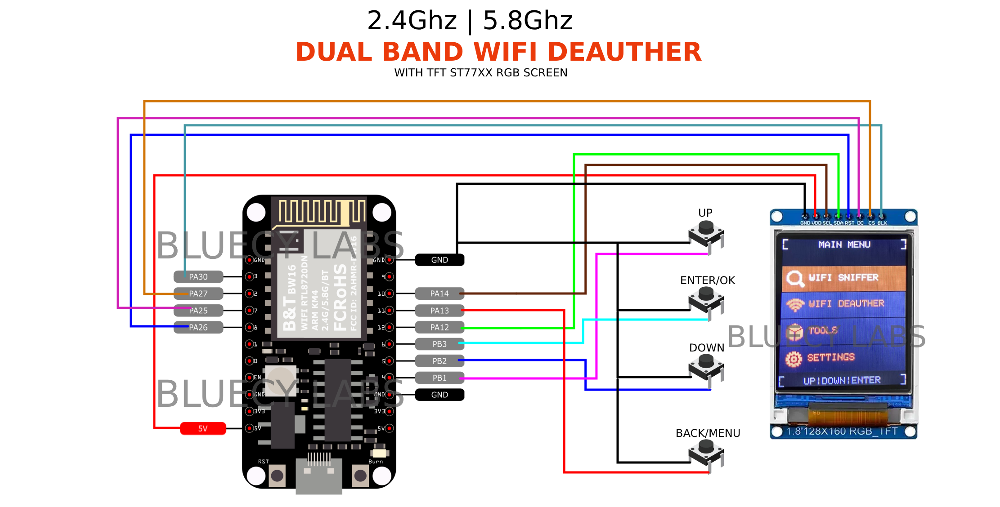
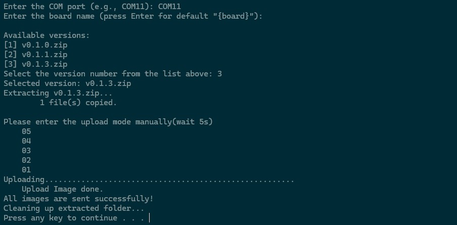

# MAVERICK
Marverick (pronounced as `/ˈmævrɪk/`), is the first firmware running on RTL8720DN BW16 kit with a TF screen.

This firmware was designed for Wireless testing purpose and education only.

> [!IMPORTANT]  
> This is the trial version that allow user perform **50 deauthentication times**. For extra usage, contact me at TikTok @bluecylabs for extend.

# Introduction

`Maverick` is a combination of tools, library, script that combine ability of the RTL8720DN MCU and hardwares like a RGB TF screen.

# Wirings
| **RTL8720DN BW16** | **ST77x** |
| ------------------ | --------- |
| **GND**            | GND       |
| **5V**             | VDD       |
| **PA14**           | SCL       |
| **PA12**           | SDA       |
| **PA25**           | DC        |
| **PA26**           | RST       |
| **PA27**           | CS        |
| **PA30**           | BLK       |

| **RTL8720DN BW16** | **BUTTONS** | **DESCRIPTIONS**                |
| ------------------ | ------------ | --------------------------- |
| **GND**            | GND          |                             |
| **UP**             | PB1          | Move highlight option up    |
| **DOWN**           | PB2          | Move highlight option down  |
| **ENTER/OK**       | PB3          | Select item                 |
| **BACK/MENU**      | PA13         | Back or Return to main Menu |



# FLASHING / UPLOADING
Please see instruction bellow carefully to flash/upload firmware to your RTL8720DN BW16 kit.

Make sure buttons, TFT ST77xx screen and BW16 are connected and well joined.

## Download firmware
Just clone this repository, all needed files are located in the folder `maverick.v.0.1.0`

## Erase the BW16 kit
Follow this tutorial if you've just bought the RTL8720DN BW16 kit. [Step 4: Erase Flash](https://www.amebaiot.com/en/amebad-bw16-arduino-getting-started/)

## Upload firmware
1. Clone this repository to your Local Machine (PC or Laptop, Windows only)
2. Extract the zipped file and navigate to the folder
```bash
maverick_firmware/maverick.v.0.1.0
```
3. Execute the `upload.bat` by double click on the file.
4. Plug & press buttons on RTL8720DN BW16 to enter upload mode
5. Provide the COM port where the RTL8720DN BW16 is connected

6. Wait until the uploading completed
7. Press RST or disconnect the board from power then connect it back

## Q&A

For any questions, go to my Tiktok account @bluecylabs for supporting.